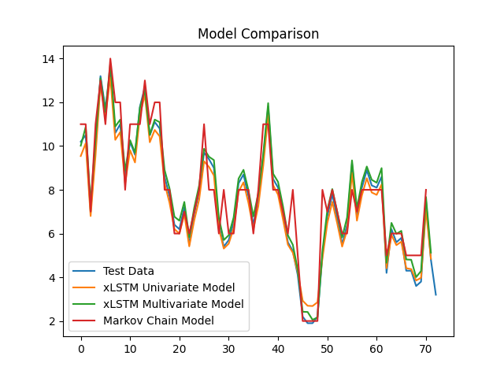
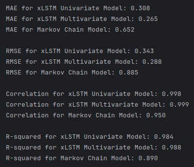

# xLSTM vs Markov Chain - Time Series Forecasting
## Getting Started 🚀

    1. Clone the repository: `git clone [repository_url]`
    2. Install dependencies: `pip install -r requirements.txt`
    3. Run code: `python main.py`

## Results 📊 🔥

## Project Description
Use Meteostat python library (https://github.com/meteostat/meteostat-python) and take one form of weather data. Predict future values based on the historical temporal sequence. The objective is to leverage the temporal dependencies within the data to create an effective predictive model. 

## 💾 Dataset
The dataset is structured around daily weather measurements, specifically fetched for Vancouver, BC, Canada. Data retrieval is facilitated by the Meteostat (https://github.com/meteostat/meteostat-python) library’s Daily class, which allows for the acquisition of historical daily weather data. A geographic point is defined for Vancouver (latitude 49.2497, longitude -123.1193, altitude 70 meters) using the Point class, pinpointing the exact location for which the data is collected. The data covers a complete calendar year from January 1, 2018, to December 31, 2018.

## Introduction to xLSTM
This implementation adopts the xLSTM model as presented by [Beck, M. et al. (2024)](https://doi.org/10.48550/arXiv.2405.04517), which introduces significant enhancements over traditional LSTM models. The xLSTM is designed to address specific limitations of conventional LSTMs by incorporating novel architectural features that improve both performance and scalability. The implementation by [andrewgcodes. (2024)](https://github.com/andrewgcodes/xlstm) was augmented and expanded upon to fuel the creation of custom classes to address this specific project. 

## File Structure
### 📄 `main.py`
This file is the entry point for the project. It contains the main function that orchestrates the entire process of data retrieval, preprocessing, model training, and evaluation. It is here that univariate and multivariate xLSTM models are trained and evaluated against a Markov Chain model. The results are then visualized using Matplotlib in conjunction with evaluation metrics such as Mean Average Error (MAE), Root Mean Squared Error (RMSE), correlation, and coefficient of determination (R2), offering a nuanced view of their predictive capabilities.

### 📄 `xLSTM.py`
This file contains a custom implementation of the xLSTM model. The xLSTM class is designed to encapsulate the model architecture which can be described in two parts ...
#### A. xLSTM Layers
- **mLSTM (Matrix LSTM):** Incorporates a matrix memory state and covariance update rule, which allows for full parallelization and efficient memory utilization. This layer is designed to enhance the LSTM's ability to store and retrieve information dynamically, making it highly effective for tasks requiring complex memory management ([Beck, M. et al., 2024](https://doi.org/10.48550/arXiv.2405.04517) pp. 4-5). 
- **sLSTM (Scalar LSTM):** Features a scalar memory update and new memory mixing techniques that improve the model's ability to handle long-range dependencies. Exponential gating is used in this layer to stabilize the training process and prevent gradient explosions ([Beck, M. et al., 2024](https://doi.org/10.48550/arXiv.2405.04517) pp. 3-4). 
#### B. xLSTM Blocks
Each xLSTM block, which may contain either or both types of [layers](#a-xlstm-layers), passes information through residual connections, allowing the model to learn deep representations without loss of performance due to vanishing or exploding gradients ([Beck, M. et al., 2024](https://doi.org/10.48550/arXiv.2405.04517) pp. 5-6). 

### 📄 `early_stopping.py`
This file contains a custom EarlyStopping class, which is used to monitor validation loss and halt training when improvements cease. Each time there is an improvement in loss, evaluating on a validation data set during training, the model’s current state in training is saved. Whenever ever losses don’t improve from the recorded minimum the early stopping object’s patience counter is incremented and it triggers the [dynamic dropout layer](#-dynamic_dropoutpy)’s rate to increase. Every time the loss improves the patience counter is reset back to 0 and the [dynamic dropout layer](#-dynamic_dropoutpy) is triggered to decrease its rate. By saving the model with the best overall validation losses we can preserve the model at the exact point in the training that it was performing the best. We then load the model’s best saved state after training has finished. 

### 📄 `dynamic_dropout.py`
This file contains a custom DynamicDropout class, which is used to dynamically adjust the dropout rate during training. This custom layer class adjusts the rate in either direction by a factor of 0.02 for a minimum of 0 and a maximum of 0.1. These adjustments during training are meant to help the model to avoid local minima and ensure stable convergence to the optimal solution.

### 📄 `markov.py`
This file contains a custom implementation of the Markov Chain model.

## References
andrewgcodes. (2024) 'xLSTM: my attempts at implementing various bits of Sepp Hochreiter's new xLSTM architecture', GitHub repository. Available at: https://github.com/andrewgcodes/xlstm (Accessed: 9 May 2024). 

Beck, M. et al. (2024) 'xLSTM: Extended Long Short-Term Memory', arXiv, [Preprint], 7 May. Available at: https://doi.org/10.48550/arXiv.2405.04517 (Accessed: 9 May 2024).
